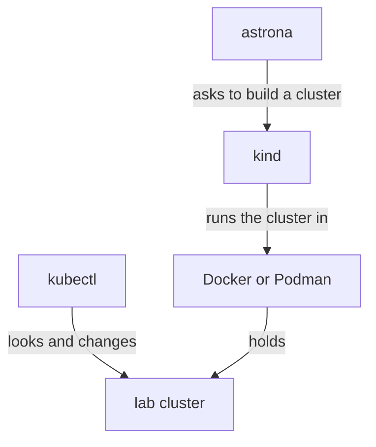

# Get Your Machine Ready

Astronaut, before any mission there is a pre-flight check. A lab runs a whole Kubernetes cluster on your own computer, so your computer needs a few tools first. The good news: one command installs them, and a second one checks them.

This part explains what each tool is for, so that later you know which one to blame when something goes wrong.

## What a lab runs on

A lab is a small, complete Kubernetes cluster. Kubernetes is a system that runs apps in containers and keeps them running. Picture a cluster as a solar system: a place where many spaceships (your apps) fly and are looked after. In a lab, that solar system is a training one, built inside a simulator on your own computer.

Four tools work together to build and reach it. Each one has a clear job.

### The four tools and their jobs

| Tool | Its job | Space picture |
| --- | --- | --- |
| `astrona` | Builds the lab, sets up the problem, grades your work and removes the lab | The simulator's control desk |
| Docker or Podman | A **container engine**: it runs containers, which are small boxed-up programs. The lab's cluster lives inside it | The simulator hall the training solar system runs in |
| `kind` | Short for "Kubernetes in Docker". It builds a Kubernetes cluster out of containers in the container engine | The machine that builds the training solar system inside the hall |
| `kubectl` | The Kubernetes command-line tool. You type `kubectl` commands to look at the cluster and change it | Your radio to mission control |

You only type `astrona` and `kubectl` commands yourself. The `astrona` tool calls `kind` for you, and `kind` uses the container engine.



The `astrona` tool builds the cluster through `kind`, the container engine holds it, and `kubectl` is how you talk to it.

## Install and check in two commands

You could install each tool by hand, but you do not have to. The `astrona` tool can do it for you, and it asks before every step. Here is the order: install `astrona` itself, let it install the rest, then let it check the result.

### Install the astrona tool

On macOS and Linux, install it with Homebrew, a common package installer:

```sh
brew install astrona-io/tap/astrona
```

On Windows, labs run inside WSL 2 (the Windows Subsystem for Linux, a real Linux system that runs inside Windows). The Windows version of the tool, `astrona.exe`, prepares WSL 2 and installs `astrona` inside it when you run its setup. The Astrona website's setup page walks you through it.

### Let astrona install the rest

Run the setup command:

```sh
astrona setup
```

The setup command looks at what is missing and shows each step before it takes it. On macOS it installs `kind`, `kubectl` and Podman with Homebrew, then creates and starts the Podman machine, or starts Docker Desktop if that is what you have. On Linux it installs `kind` and `kubectl`, and tells you the command to install a container engine, because that belongs to your Linux system. Nothing is installed until you say yes.

### Check that everything is ready

When setup finishes, it runs the check for you. You can also run the check on its own at any time:

```sh
astrona check
```

Every line under "Required" should show a ✓. The check looks at three things: the tools are installed, the container engine is running, and the container engine has enough memory and processor power. A ✗ means something is missing and the command fails; a ⚠ is only a warning.

The first lab needs about 1.2 GB of memory for the container engine, and it builds in under a minute.

> [!TIP]
> When a lab will not start, run `astrona check` before anything else. Most launch failures are a stopped container engine or too little memory, and the check finds both in a few seconds.

## Common pitfalls

> [!WARNING]
> - **The container engine is installed but not running.** The lab's cluster lives inside Docker or Podman, so it must be started first. `astrona check` shows a ✗ when it is not running.
> - **Too little memory for the container engine.** On macOS and Windows, Docker and Podman get a fixed share of your memory. If it is too small, the cluster fails to start.
> - **Typing the `$` sign.** When a command block starts with `$`, it only marks the start of a command. Type what comes after it.
> - **Installing the tools by hand in a different way.** You can, but then you have to fix any version problems yourself. Let `astrona setup` do it.

> *Four tools, four jobs: `astrona` runs the mission, `kind` builds the solar system, Docker or Podman holds it, and `kubectl` is your radio.*
