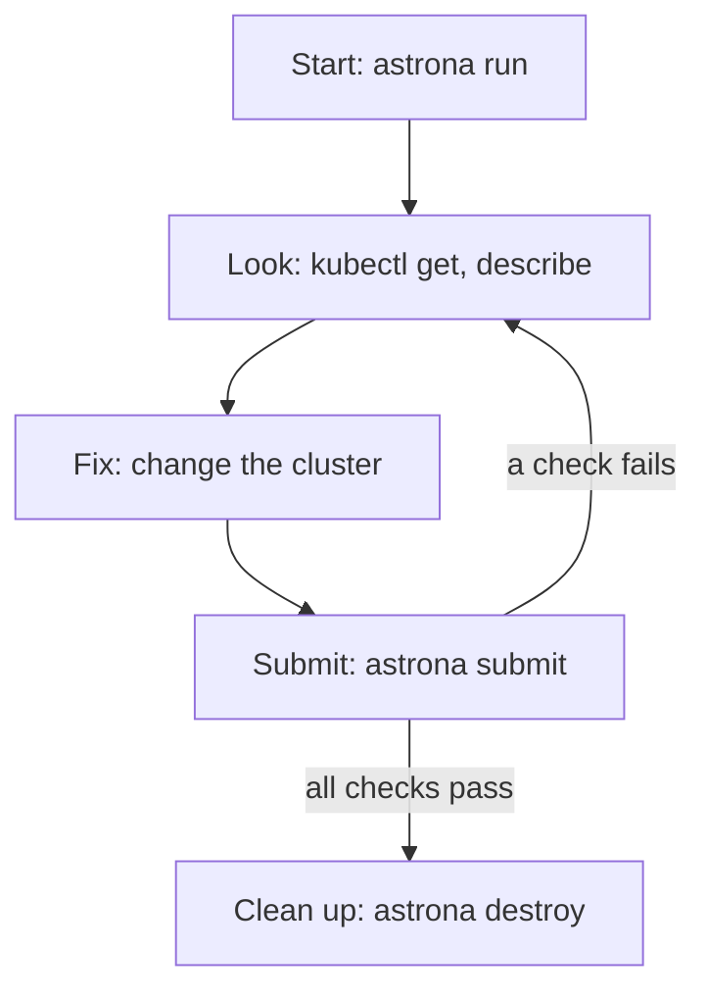

# The Four Steps Of Every Mission

Every Astrona lab, from this first one to the hardest exam practice, follows the same four steps: start, look, fix, submit. Then you clean up. Learn the steps once, and every later lab is only about its real problem.

This part walks through each step with the first lab's commands, and says which tool does the work at each step.

## The loop at a glance

Before the details, here is the whole loop in one picture. You move round it until the grader is happy, and then you leave.



The loop goes start, look, fix, submit. A failed check sends you back to look again; when every check passes, you clean up.

## Start the mission

The first step builds the training solar system and puts a problem in it. One command does all of that, and it takes about a minute.

### Launch with astrona run

Every lab has a name. For a lab from the Astrona catalog, the name looks like a path: course, section, module and lab. The first lab is `ATS000/section-010/module-01/lab-01`. Catalog labs are tied to your Astrona account, so sign in once first:

```sh
astrona login
```

Then start the lab:

```console
$ astrona run ATS000/section-010/module-01/lab-01
```

Here is what happens. The `astrona` tool asks `kind` to build a small Kubernetes cluster inside your container engine. Then `astrona` sets up the lab's starting state in that cluster: the broken app you will fix. When it is done, it prints how to connect.

### Read the task

Each lab comes with its task. You can read it on the lab page, or in your terminal:

```sh
astrona docs question ATS000/section-010/module-01/lab-01
```

Read the whole task before you type anything else. It tells you the names to use and the rules you must keep, for example "keep 2 replicas".

## Look and fix

The middle of the loop is where the real work happens. You look at the cluster with `kubectl`, find what is wrong, and change it.

### Open a lab shell

```console
$ astrona shell
```

This opens a new shell, a fresh command prompt in your terminal. In it, `kubectl` talks to your lab's cluster, and only to it. It is like a cockpit console whose radio is tuned to this one solar system. The `astrona` tool does this by pointing `kubectl` at the lab's own settings file, so your own `kubectl` settings stay as they were. Type `exit` to leave the lab shell.

Inside the lab shell, `kubectl get` lists things and `kubectl describe` explains one thing in detail. Then you change the cluster until it matches the task. In the first lab, that is one `kubectl` command.

## Submit and clean up

When you think you are done, you ask for a grade. The grade is not a guess: the grader looks at your live cluster.

### Submit for grading

Leave the lab shell first, then submit:

```console
$ exit
$ astrona submit ATS000/section-010/module-01/lab-01
```

The grader is called the **Proctor**. Think of it as a flight examiner with a checklist. It runs every check in the lab's checklist against your cluster, one by one. A check that fails shows a hint, and you get a score. When every check passes, the result in the first lab ends like this:

```text
3 passed, 0 failed
Score: 4/4 points (100%)

PROCTOR: PASS
```

You can submit as often as you like. If a check fails, read its hint, go back to looking, fix, and submit again. Every attempt is recorded, and `astrona submit --history` lists them.

After a passing result, `astrona submit` asks whether to delete the lab cluster now. Pressing Enter deletes it, the same as the next step.

### Remove the lab

A lab cluster uses memory on your computer until you remove it:

```console
$ astrona destroy ATS000/section-010/module-01/lab-01
```

The `astrona` tool deletes the lab's cluster and frees the memory it used. To see which labs are still running on your computer, use `astrona list`.

> [!TIP]
> Make `astrona list` a habit at the end of every session. A forgotten lab keeps eating memory, and the next lab may then fail to start.

## Common pitfalls

> [!WARNING]
> - **Running `kubectl` before the lab is ready.** Wait until `astrona run` has finished and printed how to connect.
> - **Thinking the grade looks at the commands you typed.** The Proctor only looks at the cluster as it is when you submit. If you undo a fix by mistake, the check fails, however good your commands were.
> - **Skipping the task text.** The task names the rules the grader checks, such as how many replicas to keep. A fix that breaks a rule fails a check.
> - **Leaving labs running.** Each lab is a whole cluster. Remove it with `astrona destroy` when you are done.

> *Start, look, fix, submit, clean up: the same five moves on every mission.*
